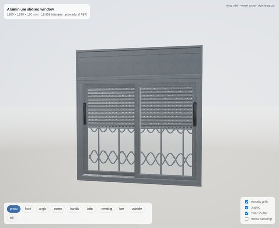
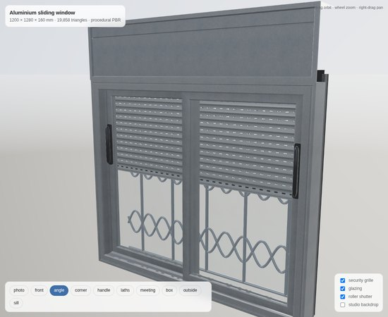
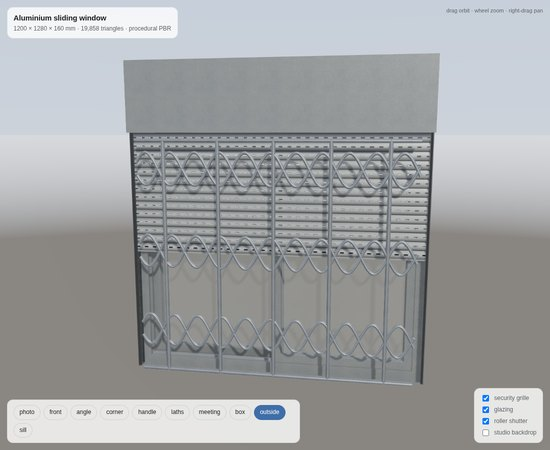
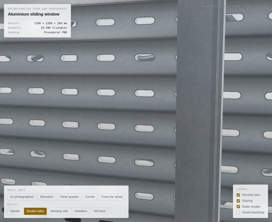
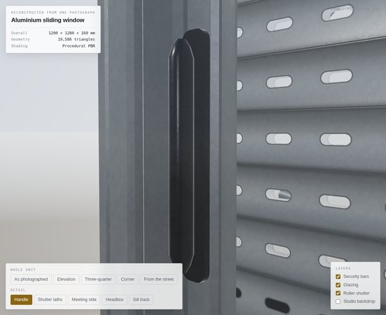

# window3d — photograph → detailed, textured 3-D model

A reconstruction of the aluminium sliding window in the reference photograph as
a fully textured PBR asset, plus the reusable pipeline that produced it.



| | |
|---|---|
|  |  |
|  |  |

## What is in `out/`

| file | what it is |
|---|---|
| `window.glb` | self-contained glTF 2.0 binary — geometry, PBR materials, embedded PNG textures, tangents and baked AO. Drop into Blender, three.js, Unreal, Godot, Quick Look, Windows 3D Viewer. |
| `window.obj` + `window.mtl` | same model for DCC apps that prefer OBJ. Vertex colours carry the baked AO; the MTL uses the `Pr`/`Pm`/`norm` PBR extensions. |
| `textures/*.png` | the procedural map set, for anyone re-authoring materials. |
| `viewer.html` | standalone WebGL2 viewer (no CDN, no network) with the model embedded. Open it in a browser. |

Build everything with:

```bash
python3 build.py                 # out/window.glb, .obj, .mtl, textures/, viewer.html
python3 build.py --wall          # include a plastered reveal for in-situ shots
python3 build.py --no-grille     # window only, without the security bars
node shots.mjs photo,angle,sill  # headless Chromium renders into out/shots/
```

Requires `numpy` and `pillow`; `shots.mjs` additionally needs `playwright`.

## The model

19.9 k triangles, 13.6 k vertices, real-world scale in metres.

Parts are separate nodes so they can be hidden or animated: `frame`,
`shutter_box`, `sash_left` / `sash_right` (+ glass), `handles`, `seals`,
`shutter_laths_vented`, `shutter_bottom_rail`, `shutter_guides`,
`security_grille`, `slot_cavity`.

### Dimensions read off the photograph

The 600 mm floor tiles and the standard Israeli window module set the scale;
everything else was measured against the window's own pixel width.

| feature | value |
|---|---|
| overall unit | 1200 × 1280 × 160 mm |
| roller-shutter headbox | 280 mm tall, 162 mm deep |
| frame face / depth | 49 mm / 100 mm |
| sash stile & rail face | 42 mm, 32 mm deep, 45 mm interlock |
| glazing | 6 mm, single, in a captive groove |
| shutter lath | 50 mm pitch, 11 mm thick, rolled crown |
| vent slot | ≈28 × 8.5 mm capsule, 58 mm pitch |
| curtain position | lowered to 500 mm — just under half the opening |
| handle | 200 mm vertical pull on each jamb-side stile |
| security bars | 16 mm verticals at 219 mm, 12.4 mm ogee ribbons whose crossings land on the verticals |

### How the geometry is built

* **`rect_tube()`** sweeps a closed 2-D cross-section around a rectangle with
  45° mitres. Frame and sashes are real extruded profiles — rebates, glazing
  grooves, shadow grooves and chamfers are geometry, not texture. Corner joints
  seal exactly because both members meet on the `t == t` plane.
* **`loft()` / `tube()`** skin point rings, used for the handles and the
  wrought-iron ogee lattice.
* **Shutter laths** are front/back sheets that share one UV cell, so the punched
  slot in the alpha map removes both at once and daylight reads straight
  through, exactly as in the photo.

### Materials

One shared, seamlessly tileable detail set (base colour, ORM, normal) authored
around 1.0 and multiplied by each material's factors — so eleven materials cost
three textures. Colours are sampled from the photograph and converted to
intrinsic linear albedo. Tiling is 125 mm, giving ~3 mm powder-coat orange peel.

Ambient occlusion is ray-marched against a voxelised copy of the model and
stored in the standard glTF `COLOR_0` attribute, so the crevice darkening at the
mitres, glazing rebates and lath laps survives export into any renderer.

## Reusing this for other objects

The pipeline is deliberately split so that only one file is object-specific:

```
mesh.py       generic hard-surface toolkit (mitred sweeps, lofts, tubes, welding)
textures.py   procedural, tileable PBR maps authored as multipliers
ao.py         voxel ray-marched ambient occlusion -> COLOR_0
validate.py   geometry checks run on every build (winding, degeneracy, silhouette)
gltf.py       GLB writer: welding, tangents, PBR materials, embedded PNGs
model.py      <- the only object-specific file: measurements + assembly
build.py      orchestration and OBJ/MTL export
viewer_*.html WebGL2 PBR viewer used both for delivery and for self-review
shots.mjs     headless renders, so results can be inspected and iterated on
```

To model a different object from a photograph:

1. **Scale it.** Find something of known size in the frame (floor tile, brick
   course, door leaf, a standard product module) and derive metres-per-pixel.
2. **Measure it** into a constants block, and write down what the reference for
   each number was — that is what makes the result checkable later.
3. **Identify the construction**, not just the silhouette. Extruded profiles,
   lofted rails, repeated slats — modelling the manufacturing method is what
   makes an asset read as real at close range.
4. **Author materials as multipliers** over a shared detail set, and sample
   albedo from the photo with the lighting divided back out.
5. **Render and look.** `shots.mjs` exists so each iteration can be inspected
   from fixed viewpoints instead of guessed at. When a render shows something
   wrong, identify the culprit rather than guessing: the black patch in the
   third pass below was found by software-rasterising just that rectangle of
   the screen and asking which part won the depth test.
6. **Make each fixed defect a check.** `validate.py` runs on every build, so a
   face wound against its normal now fails the build instead of showing up as
   an unexplained dark shape three renders later.

### Defects the review loops caught and fixed

Worth recording, because they are the failures this kind of asset tends to have.

**Earlier passes**

* missing sRGB encode on the framebuffer — the whole model rendered near-black;
* transposed slat UVs — vent slots came out as vertical ovals instead of dashes;
* normal map ~15× too strong — powder-coated aluminium looked like stucco;
* handle section wound the wrong way — the tube rendered inside-out;
* sash faces exactly coplanar with the frame rebate — z-fighting along the sill;
* shadow depth bias larger than the 7 mm track ledges — sunlight leaked through;
* shutter guides and the slot cavity poking past the frame outline.

**Measurement pass** — comparing renders against the photograph feature by
feature:

* shutter lath pitch was 34.5 mm against ~50 mm in the photo, so the curtain
  read as a venetian blind rather than a roller shutter;
* the ogee ribbons used a period equal to the bar spacing. A sine and its
  mirror cross every *half* period, so the pointed arches came out half-width
  and landed between the verticals instead of on them;
* the shutter guides were near-black and deeper than they needed to be, so they
  read as a floating dark bar beside the frame.

**Correctness pass** — a black rectangle at the headbox/frame junction, traced
to its owner by rasterising that screen rectangle offline:

* `box()` wound four of its six faces backwards. With back-face culling on,
  the headbox's underside was culled from below and drawn from above with a
  downward-facing normal — an unlit black patch. The same bug affected the
  glazing, the seals and the slot cavity;
* the headbox's hand-built bottom face and the wall reveal returns were wound
  against their explicitly supplied normals;
* `add_polygon()` fanned every outline, which is only valid for convex ones.
  The crescent-shaped lath sections and the C-channel guide profile produced
  inverted and degenerate triangles; it now ear-clips.
